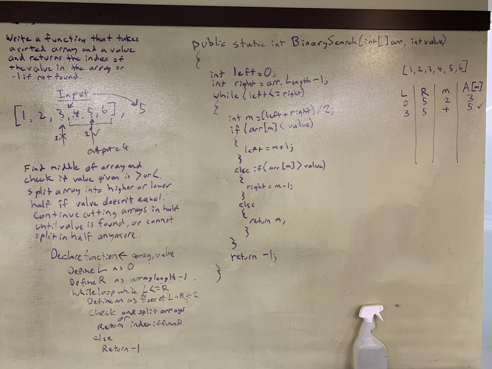

# .NET Data Structures and Algorithms

## Binary Search

*Author: Chris Cummings*

---

## Description

Write a function called BinarySearch which takes in 2 parameters: a sorted array and the search key. 
Without utilizing any of the built-in methods available to your language, return the index of 
the array’s element that is equal to the search key, or -1 if the element does not exist.

---

## Approach

I first defined the left variable as 0, and put a try catch block to take into account empty arrays.
I then created a while loop that ran until left was greater or equal to right, which searched the middle
of the array and set the left or right according to if the value was higher or lower, cutting the array
into smaller and smaller halves until the number was found, or until the search ran out of indices to search.

---

## Visuals

---

## Change Log

1.1: Finished Binary Search Challenge - 10/18/2019

---

