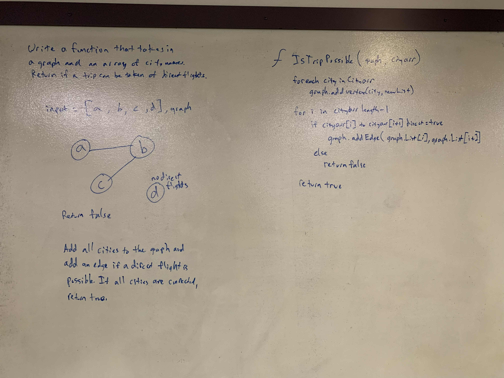

# .NET Data Structures and Algorithms

## Direct Flights with a Graph

*Author: Chris Cummings*

---

## Description

Write a function which takes in a graph, and an array of city names.
Return whether the full trip is possible with direct flights, and how much it would cost.

---

## Approach

Add all cities to the graph.  Add an edge if a direct flight is possible. If any edges cannot be added,
return false. If all edges are added, return true.

---

## Visuals

---

## Change Log

1.1: Finished whiteboard and readme - 12/05/2019

---

