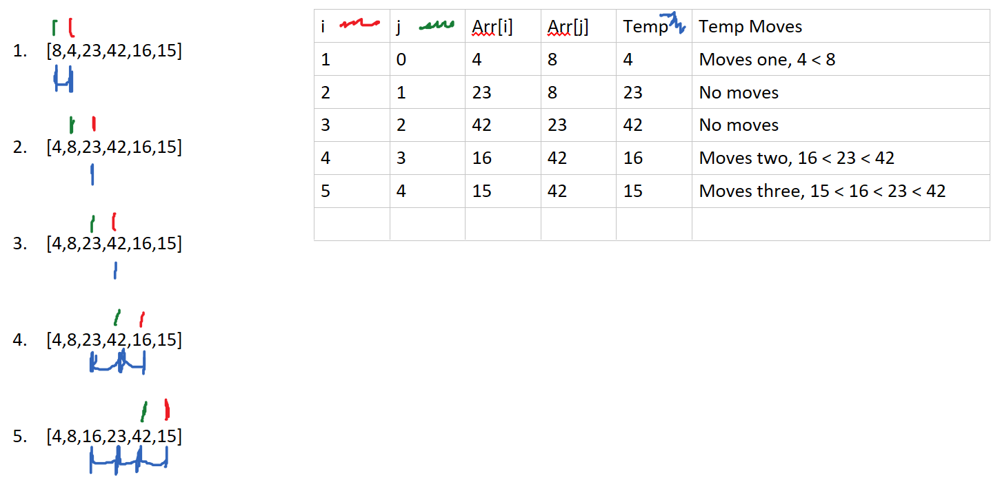

# Insertion Sort
---

Insertion sort is a method of sorting an array.  The trick for insertion
sort is that you need to make sure you are keeping track of a few things:

* The current index that is being defined.
* Set a marker for the current position in the array, where everything
to the left of the marker is sorted.
* A temporary variable for storing the current value that is being evaluated.

---

## Pseudo Code

```InsertionSort(int[] arr)
  
    FOR i = 1 to arr.length
    
      int j <-- i - 1
      int temp <-- arr[i]
      
      WHILE j >= 0 AND temp < arr[j]
        arr[j + 1] <-- arr[j]
        j <-- j - 1
        
      arr[j + 1] <-- temp

```

---

## Explanation


1) Defines i and j as the first two number in the array. Everything to the
left of j counts as "sorted". Arr[i] is stored in temp, and is checked against
all numbers in the "sorted" portion of the array.  It moves over one and
finishes the loop. Then i and j are incremented.
2) 4 and 8 now count as sorted. Arr[i] is now 23. It is checked against
the first number in the "sorted" part of the array. It is not lower, so
no numbers move. i and j and incremented.
3) Same as previous. Arr[i] is 42, which checks against 23 and is not lower,
so no numbers move. i and j are incremented.
4) Arr[i] is 16, Arr[j] is 42. Arr[j] is larger, so it is incremented
backwards as long as the temp variable (16) is lower than Arr[j].  16 is
moved over two and is now sorted in between 8 and 23.
5) Same as previous, but 15 is moved one more step than 16 was.

---

# Efficiency

### Time: 
* Best: O(n)
* Worst: O(n^2)
  * The basic operation of the loop is a while loop inside of the for loop.
  in a best case, the array is sorted so it only runs through once. Worst
  case, the array has to run through multiple times for each sort.
### Space:
* Best: O(1)
* Worst: O(1)
  * There is no recursion or creating of new arrays, everything is done in
  place so space is O(1).