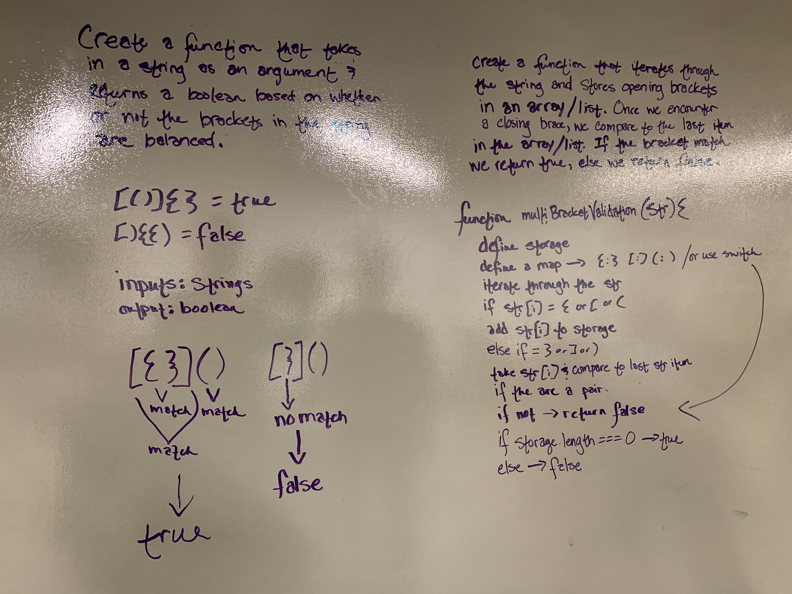

# .NET Data Structures and Algorithms

## Multi Bracket Validation

*Author: Chris Cummings*

---

## Description

Your function should take a string as its only argument, and should return a boolean representing whether
or not the brackets in the string are balanced. There are 3 types of brackets:

*Round Brackets : ()
*Square Brackets : []
*Curly Brackets : {}

---

## Approach

I created a storage to store any opening brackets. I then iterated through the string checking each character.
For opening brackets, I stored them.  For closing brackets, I checked to see if the last thing stored was the
closing bracket that matched.  If it wasn't I returned true.  If it was, I kepted iterating through the string.

---

## Visuals

---

## Change Log

1.1: Finished All functionality and unit tests. - 10/31/2019

---

