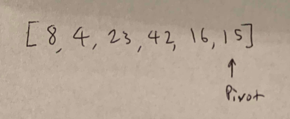
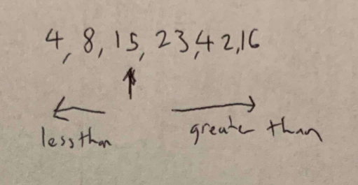
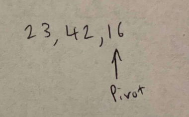
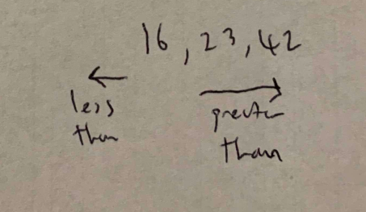

# Quick Sort
---

Quick sort is a method of sorting an array.  Quick recursively calls itself
and sorts itself based on a pivot value. The numbers are sorted to be less
than or greater than the pivot, and the two sides are called recursivley 
each with their own new pivot.

---

## Pseudo Code

```
ALGORITHM QuickSort(arr, left, right)
    if left < right
        // Partition the array by setting the position of the pivot value 
        DEFINE position <-- Partition(arr, left, right)
        // Sort the left
        QuickSort(arr, left, position - 1)
        // Sort the right
        QuickSort(arr, position + 1, right)

ALGORITHM Partition(arr, left, right)
    // set a pivot value as a point of reference
    DEFINE pivot <-- arr[right]
    // create a variable to track the largest index of numbers lower than the defined pivot
    DEFINE low <-- left - 1
    for i <- left to right do
        if arr[i] <= pivot
            low++
            Swap(arr, i, low)

     // place the value of the pivot location in the middle.
     // all numbers smaller than the pivot are on the left, larger on the right. 
     Swap(arr, right, low + 1)
    // return the pivot index point
     return low + 1

ALGORITHM Swap(arr, i, low)
    DEFINE temp;
    temp <-- arr[i]
    arr[i] <-- arr[low]
    arr[low] <-- temp

```

---

## Explanation


1) You start by first defining a pivot point randomly in the length of the
array. 

2) You then step through the array, sorting the values to the left or the
right of the pivot, based on if it's less than or greater than the pivot value.

3) You then split the arrays recursively, and choose new pivots in the new
array, but in this case, the beginning of the array (4, 8 and 15) are already
sorted.

4) From the pivot chosen in the smaller left or right of the array, the 
process is repeated of sorting. This happens recursively until the array is
fully sorted.

---

# Efficiency

### Time: 
* Best: O(nlg(n))
* Worst: O(n^2)
  * The function runs recursively.  In the best case scenario, the array is
  pre-sorted.
### Space:
* Best: O(1)
* Worst: O(1)
  * Quick Sort is in place, and swaps variables only in the same array, so the
  space is O(1).