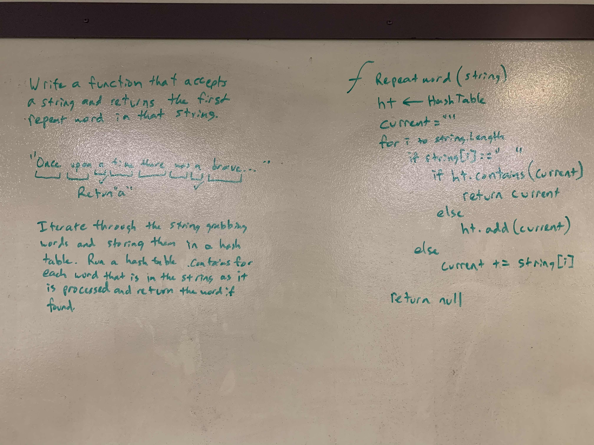

# .NET Data Structures and Algorithms

## Repeat Word

*Author: Chris Cummings*

---

## Description

Write a function that accepts a lengthy string parameter and 
returns the first word to occur more than once in that provided string.

---

## Approach

Iterate throug the string and when you reach a space (" "), check and see if the word exists already in the
hash table. If it does, return the word. If it does not, add the word to the hash table and continue iterating
through the string.

---

## Visuals

---

## Change Log

1.1: Finished whiteboard and readme - 11/25/2019

---

