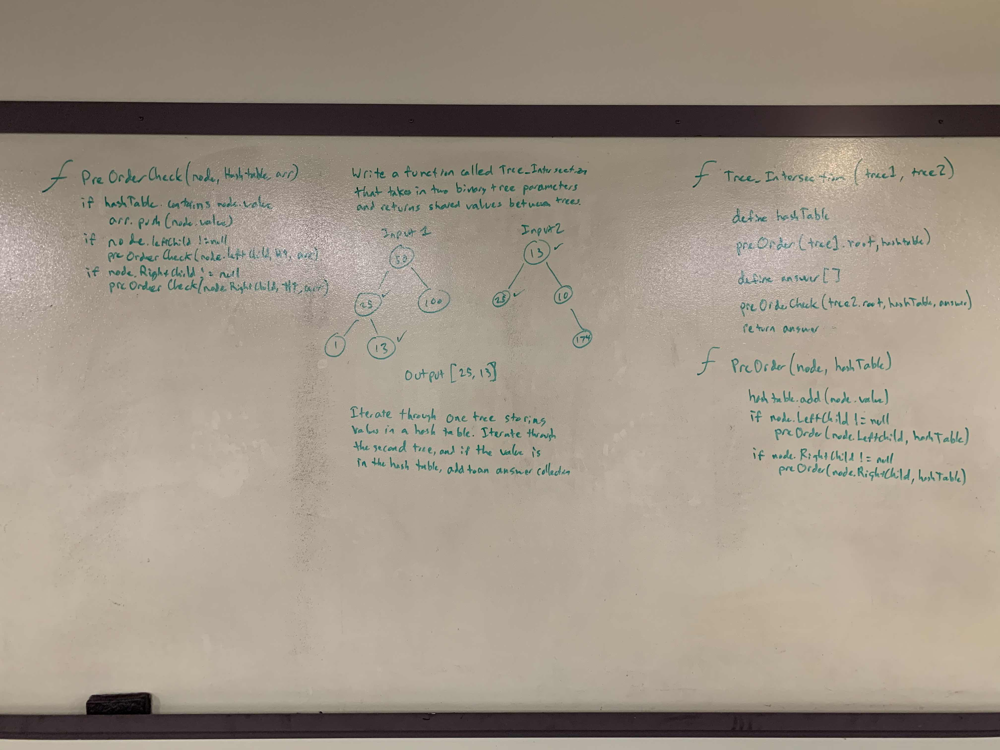

# .NET Data Structures and Algorithms

## Tree Intersection

*Author: Chris Cummings*

---

## Description

Write a function called tree_intersection that takes two binary tree parameters and
return a set of values found in both trees.

---

## Approach

Iterate through the first tree and store all values ni a hash table. Iterate through the second tree and if
the value is already in the hash table, store that answer in an answer collection. Return the answer collection
once the second tree is iterated through.

---

## Visuals

---

## Change Log

1.1: Finished whiteboard and readme - 11/27/2019

---

