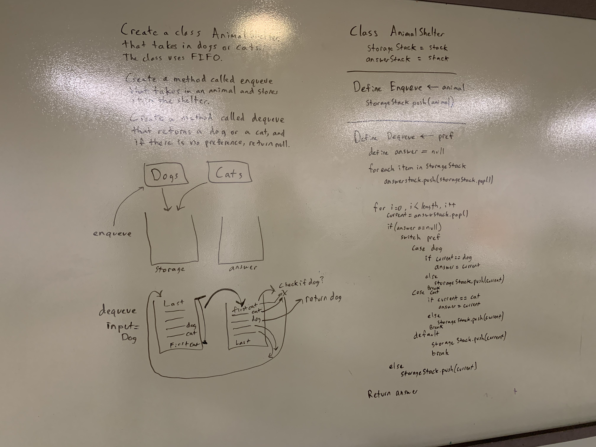

# .NET Data Structures and Algorithms

## Queue of Objects

*Author: Chris Cummings*

---

## Description

Create a class called AnimalShelter which holds only dogs and cats. The shelter operates using a first-in, 
first-out approach.

Implement the following methods:

enqueue(animal): adds animal to the shelter. animal can be either a dog or a cat object.

dequeue(pref): returns either a dog or a cat. If pref is not "dog" or "cat" then return null.

---

## Approach

AnimalShelter - The AnimalShelter class is a queue that is created from two private stacks.

.enqueue - This method adds a new Animal to the storage stack. If storage stack is empty, sets the Animal to the Head.

.dequeue - This method adds takes in a string of the preferred animal. The storage stack is dumped into the answer stack,
then each value is checked to see if it's the type that from the inputted string. If it is, the answer is stored after the
storage stack is repopulated. If not, the item is put back into the storage stack.

---

## Visuals

---

1.1: Finished all functionality and unit testing - 10/30/2019
