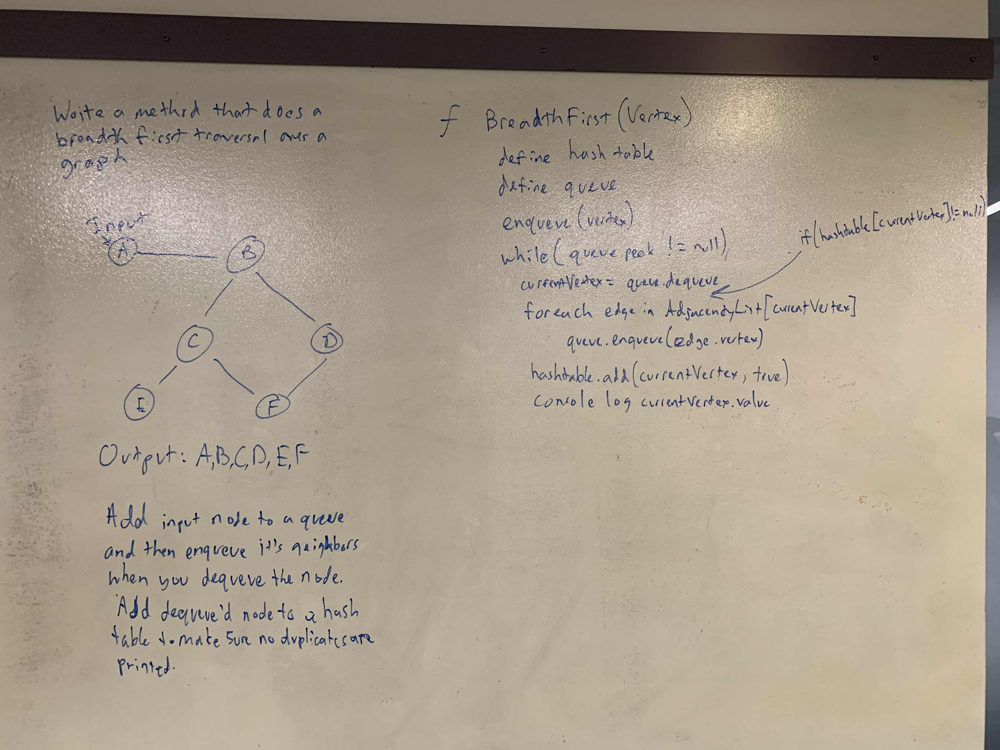

# .NET Data Structures and Algorithms

## Graph

*Author: Chris Cummings*

---

## Description

Implement your own Graph. The graph should be represented as an adjacency list, and should include the following methods:

AddNode()
* Adds a new node to the graph
* Takes in the value of that node
* Returns the added node

AddEdge()
* Adds a new edge between two nodes in the graph
* Include the ability to have a “weight”
* Takes in the two nodes to be connected by the edge
* Both nodes should already be in the Graph

GetNodes()
* Returns all of the nodes in the graph as a collection (set, list, or similar)

GetNeighbors()
* Returns a collection of nodes connected to the given node
* Takes in a given node
* Include the weight of the connection in the returned collection

Size()
* Returns the total number of nodes in the graph

BreadthFirst()
* Accepts a starting node and returns a collection of nodes in the order they were visited. Display the collection.

---

## Approach

Create a Graph with an AdjacencyList dictionary and a size parameter.

`.AddVertex`: take in a value and create a new vertex with the value. Add the vertex to the dictionary as a key
and add a new list collection of Edges as the value. Add 1 to the size parameter.

`.AddEdge`: Split this into two methods, `AddDirectedEdge` and `AddUndirectedEdge`. For `AddDirectedEdge`, take in two nodes, the first node
being the source and the second node being the destination. Also take in a weight.  Create a new edge object and 
set the connection vertext to the destination, and set the weight. Add the edge to the list by calling the dictionary
with the key of the source. For `AddUndirectedEdge`, call the `AddDirectedEdge` method twice, once with the 
source and the destination in the normal spots, then again but switch destination and source.

`.GetVertices`: Foreach over the list dictionary, and add each key to a new list. Return the list.

`.GetNeighbors`: Take in a vertex and return the value of the AdjacencyList using the vertex as the key.

`.Size` : Return the size parameter.

---

`.BreadthFirst`: Create a hashtable and a queue. Enqueue the input vertex. Loop through while there is something
in the queue. While looping, dequeue the vertex.  If the vertex isn't in the hashtable, add it to the hashtable,
enqueue it's children, add it to the hash table and log it's value.

---

## Visuals

---

## Change Log

1.1: Finished coding and readme - 12/04/2019

1.2: Finished whiteboard and readme for breadthfirst - 12/04/2019

---

