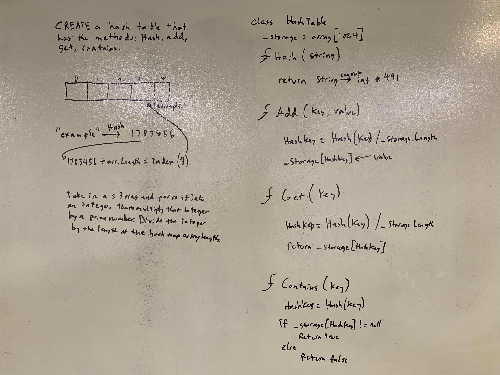

# .NET Data Structures and Algorithms

## Hash Table

*Author: Chris Cummings*

---

## Description

Implement a `Hashtable` with the following methods:

1. `add`: takes in both the key and value. This method should hash the key, and add the key and value pair to the table, handling collisions as needed.
2. `get`: takes in the key and returns the value from the table.
3. `contains`: takes in the key and returns a boolean, indicating if the key exists in the table already.
4. `hash`: takes in an arbitrary key and returns an index in the collection.

---

## Approach

Create a class called HashTable that has a private array storage of a fixed size.

`.add`: take in a key and a value. Hash the key and divide it by the length of the array. Add value to array
at the location provided by the hash and division.

`.get`: take in a key. Hash the key and divide it by the length of the array. Return value that is at the array
at index provided by the hash and the division.

`.contains`: take in a key. Hash the key and divide it by the length of the array. Return true if the array at
index provided by the hash and the division is not null. Return false if null.

`.hash`: take in a key. Return the key converted to integers and multiplied by 491. 

---

## Visuals

---

## Change Log

1.1: Finished whiteboard and readme - 11/25/2019

---

