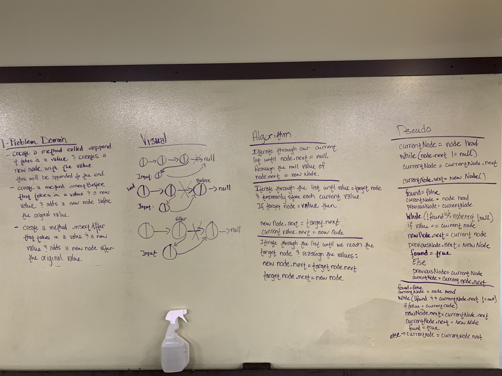
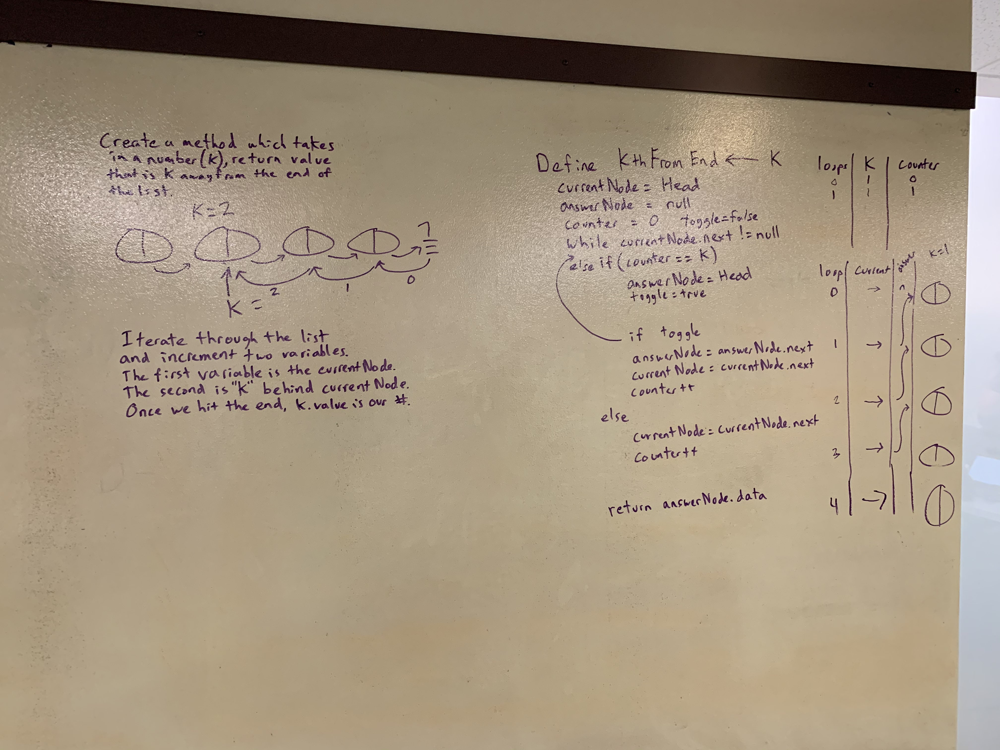

# .NET Data Structures and Algorithms

## Linked List

*Author: Chris Cummings*

---

## Description

Write the following methods for the Linked List class:

.insert(value) which adds a new value to the start of the list.

.includes(value) which checks to see if a value is in the list and returns true or false.

.dataToString() which takes all data from the list and returns them as a string.

.append(value) which adds a new node with the given value to the end of the list.

.insertBefore(value, newVal) which add a new node with the given newValue immediately before the first value node.

.insertAfter(value, newVal) which add a new node with the given newValue immediately after the first value node.

.kthFromTheEnd(index) which retrieves the value of a node that is kth from the end of the list.

.mergeLists(linkedList1, linkedList2) which merges two linked lists together in a zipper pattern. 1.1 -> 2.1 -> 1.2 -> etc.

---

## Approach

.insert = creates a new node and sets it's pointer to the head and then reassigns the head to the new node.

.include = Iterate through the linked list and returns true if the value is found. Returns false if the value isn't found.

.dataToString = Iterate through the linked list and adds data value to a string. Returns the string when loop is done.

.append = Iterated through the linked list and once the last node pointed to null, switched the pointer to the new node.

.insertBefore = Iterate through the linked list and search each node value for the value inputted into the method.
When the value is found, reassign the previous node Next to new node and the new Node Next to the current node.

.insertAfter = Iterate through the linked list and search each node value for the value inputted into the mehtod.
When the value is found, reassign the new node Next to current node Next and reassign current node Next to new Node.

.kthFromTheEnd = Iterate through the list and increment two variables. The first variable is the current node, the
second is "k" behind current node.  Once the end is reached, K is the answer node and that value is returned. 

.mergeLists = Iterate over the two lists and store the current node.next for both lists.  Then reassign the current
node.next to the correct zipper pattern and use the stored variables to not lose track of the rest of the list.

---

## Visuals

---

1.1: Finished Append, InsertBefore and InsertAfter - 10/23/2019

1.2: Finished KthFromTheEnd - 10/23/2019

1.3: Finished MergeLists - 10/24/2019

1.4: Finished Insert, Includes and DataToString - 10/24/2019
