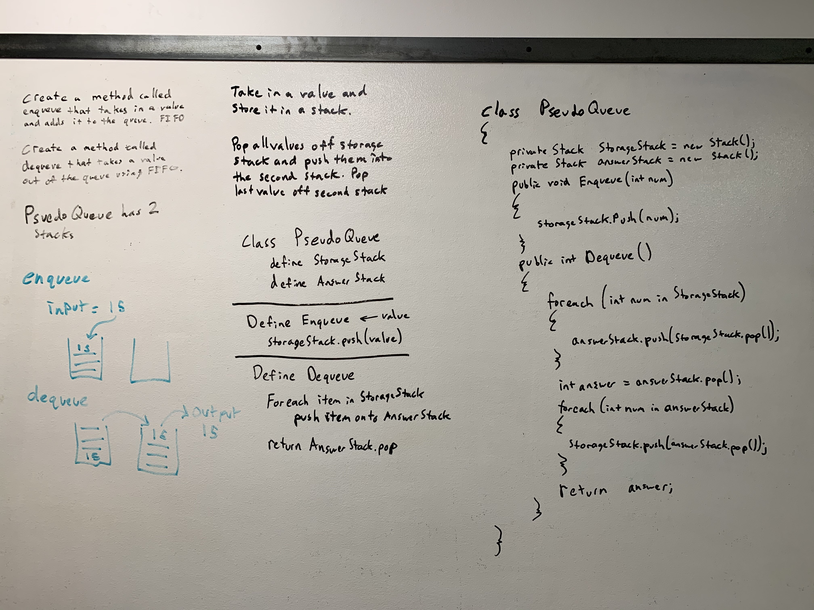

# .NET Data Structures and Algorithms

## Queue With Stacks

*Author: Chris Cummings*

---

## Description

Create a brand new PseudoQueue class. Do not use an existing Queue. 
Instead, this PseudoQueue class will implement our standard queue interface (the two methods listed below), 
but will internally only utilize 2 Stack objects. Ensure that you create your class with the following methods:

enqueue(value) which inserts value into the PseudoQueue, using a first-in, first-out approach.

dequeue() which extracts a value from the PseudoQueue, using a first-in, first-out approach.

---

## Approach

PseudoQueue - I created two stacks called storageStack and answerstack.

.Enqueue - I checked if the stack was empty, and if so I set the head to the value inputted. Otherwise, I just
pushed the value onto the storage stack and set the rear to the value.

.Dequeue - I return -1 if the storageStack is empty. If not, I pop all the values off the storageStack and push them 
onto the answerStack. I pop the last value off the answer stack which I return after dumping all the values back into
the storage stack.

---

## Visuals

---

## Change Log

1.1: Finished Queue with Stacks Challenge - 10/29/2019

---

